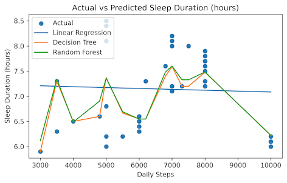
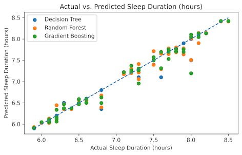

# IDS 706 Mini Assignment 2: Start Your First Data Analysis - 7 Sep 2026

## Project Description
This is the 2nd mini assignment for data analysis. The first part will cover the usage of pandas and polars with common data manipulation and visulisation. The latter part of this assignment will cover experimentation with Rust on Jupyter notebook.


## Project Structure 
```bash
IDS706-Mini-Assignment-2
├── .gitignore
├── requirements.txt         # List of packages required for installation
├── pandas_query.ipynb       # Jupyter Notebook for Data Analysis using Pandas
├── Images/                  # Images used for supporting README.md explantion
└── README.md                # Project documentation
```

## Dataset Description 
The dataset uses for this assignment is Sleep_health_and_lifestyle_dataset.csv from Kaggle. It covers a wide range of variables related to sleep and daily habits such as gender, age, occupation, sleep duration, quality of sleep, and the presence or absence of sleep disorders. This can be download from: https://www.kaggle.com/datasets/uom190346a/sleep-health-and-lifestyle-dataset


## Setup Instructions
### 1. Creat GitHub repository
General:
- Name the repository with `IDS706-Mini-Assignment-2`.

Configuration:
- Add README - Toggle On option.
- Add .gitignore - Select Python.
- Proceed to create repository.
<br><br>

### 2. Clone repository in VS Code
- Open Command Palette and select `Git: Clone`.
- Paste GitHub repository URL (e.g. https://github.com/violathadtanone/IDS706-Mini-Assignment-2).
- Select the local folder to continue the development.
<br><br>

### 3. Set up a Python virtual environment
- Create and activate the virtual environment on Terminal with the code below:
```bash
python -m venv .venv
source .venv/bin/activate
```
- Upgrade pip to ensure that it is compatible with the current Python version before installing other packages. We also include upgrade `ipykernel` since it is key for the assignment.
```bash
python -m pip install --upgrade pip
python -m pip install --upgrade ipykernel
```
<br><br>

### 4. Create requirement file for project dependencies (e.g. python packages required)
- Create a new file called `requirements.text` in the project root and add packages below in the file.
```
pandas
polars
scikit-learn
matplotlib
```
- Install the requirements in the visual environment `(.venv) (base)` with the code below in Terminal:
```bash
python -m pip install -r requirements.txt
```
<br><br>

## Part 1a: Data Analysis with Pandas
### 1. Create new Jupyter Notebook file
- Create a new file called `python_query.ipynb`
<br><br>

### 2. Import required library
- In `python_query.ipynb`, use the code below to import the installed packages during setup.
```python
import pandas as pd
import polars as pl
import numpy as np
from sklearn.model_selection import train_test_split
from sklearn.linear_model import LinearRegression
from sklearn.tree import DecisionTreeRegressor
from sklearn.tree import DecisionTreeRegressor, DecisionTreeClassifier, GradientBoostingRegressor
from sklearn.metrics import mean_squared_error, r2_score, accuracy_score, classification_report
import matplotlib.pyplot as plt
from statsmodels.miscmodels.ordinal_model import OrderedModel
```
- Check whether the packages for pandas, polars and numpy have been properly imported into the enviroment. This should return the version number.
 ```python
print(pd.__version__)
print(pl.__version__)
print(np.__version__)
```
<br><br>

### 3. Import dataset
- Add the dataset `Sleep_health_and_lifestyle_dataset.csv` into the project root.
- In `python_query.ipynb`, use the code below to import the dataset.
```python
sleep_data = pd.read_csv('Sleep_health_and_lifestyle_dataset.csv')
```
<br><br>

### 4. Perform inspection on the dataset
- Perform quick data exploration using the method in pandas via the code below.
- `.head(3)`: This will show the first 3 rows in the dataset.
- `.tail(3)`: This will show the last 3 rows in the dataset.
```python
print(sleep_data.head(3))
print(sleep_data.tail(3))
```

- `.shape`: This will show the number of rows and columns in the dataset (e.g. (374, 13) - There are 374 rows and 13 columns in this dataset).
- `.columns`: This will return all the column names.
```python
print(sleep_data.shape)
print(sleep_data.columns)
```

- `.info()`: This will hows the dataset's structure, column names, non-missing values, and data types.
- `.describe()`: This will return summary statistics such as count, mean, standard deviation, min, and max.
```python
print(sleep_data.info())
print(sleep_data.describe())
```

- For duplicated value, most columns should have duplicated value such as `'gender'`, `'age'` or `'Sleep Disorder'`. However, `'Person ID'` should be a unique identifier for this dataset. 
- `.duplicated()`: This will return the boolean value whether the value is duplicate with another value in this columns, where `.sum()` will combine the count of duplicated value together.
```python
print(f'Number of duplicates: {sleep_data["Person ID"].duplicated().sum()}')
```

- From the results of `.info()`, we can see that there are missing values under the column `'Sleep Disorder'` since there are only 155 non-null our of 374 values.
- `.value_counts()`: This will return the count of each unique value, where `dropna=False` will also return the count of na values.
```python
print(sleep_data["Sleep Disorder"].value_counts(dropna=False))
```
- `.isnull()`: This will return the boolean value whether the value is na. Noted that the data already has `NaN` value, so there is no need to use `.isna()` for the blank value. We can see which rows has a missing value by:
```python
sleep_data[sleep_data["Sleep Disorder"].isnull()]
```
<br><br>

### 5. Basic Filtering and Grouping
- In this analyis, we are interested whether are there any correlations between the number of steps a person taking daily and their sleep level.
- Create a new variable `Daily Step Level`, which groups the daily step based on the quartile range from `.describe()`, where `'Low'` <= 5,600, 5,600 < `'Medium'` < 8,000 and `'High'` >= 8000 and proceed to extract subsets of the data called `Daily Step Level` to see the differences between those with low vs high daily step count and its impact on the sleep duration and stress level.
```python
sleep_data["Daily Step Level"] = sleep_data["Daily Steps"].apply(
    lambda x: "Low" if x <= 5600 else "Medium" if x < 8000 else "High"
)
print(sleep_data["Daily Step Level"].value_counts(dropna=False))
sleep_data_analysis = sleep_data[
    sleep_data["Daily Step Level"].isin(["Low", "High"])
]
```
- `.value_counts()`: This will ompute summary statistics (e.g. mean or count) on a selected column.
```python
sleep_data_analysis.groupby("Daily Step Level").agg(
    {
        "Person ID": "nunique",
        "Sleep Duration": ["mean", "median"],
        "Stress Level": ["mean", "median"]
    }
)
```
- Here we actually noticed that those with high step count per day has a slightly better sleep duration at 7.16 compared to low at 7.156. However, those with high step count per day also have a higher level of stress at 6.044 compared to low at 5.432. Reverse casuality can also be one possible explanation such that people tend to walk more when they are more stressed in order to relax.
<br><br>

### 6a. Machine Learning Algorithm - Scenario 1
- We want to see if simply just `'Daily Steps'` can predict `'Sleep Duration'`.
- Using the model from `scikit-learn`, we start by define the variables in our model, where our explanatory variable is `'Daily Steps'`, which is the approximate number of steps the person took on a daily basis and dependent variabls is `'Sleep Duration'`, which is the number of hours the person sleeps per day.
```python
x1 = sleep_data[["Daily Steps"]]
y1 = sleep_data["Sleep Duration"]
```
- Perform random split between the train and test data set. Here we are testing 20% of the data.
```python
x1_train, x1_test, y1_train, y1_test = train_test_split(
    x1, y1, test_size=0.2, random_state=100
)
```
- **Linear Regression Model** - This will provide a good testing for simple linear relationship as our baseline.
```python
model1 = LinearRegression()
model1.fit(x1_train, y1_train)
y1_m1_pred = model1.predict(x1_test)
print("R² from Linear Regression:", r2_score(y1_test, y1_m1_pred))
print("RMSE from Linear Regression:", np.sqrt(mean_squared_error(y1_test, y1_m1_pred)))
```
- **Decision Tree Model** - This will provide a good testing for numerical variables even when they are discrete rather than continuous, because they can split the values into ranges/groups and capture non-linear relationships.
```python
model2 = DecisionTreeRegressor(random_state=100)
model2.fit(x1_train, y1_train)
y1_m2_pred = model2.predict(x1_test)
print("R² from Decision Tree Regression:", r2_score(y1_test, y1_m2_pred))
print("RMSE from Decision Tree Regression:", np.sqrt(mean_squared_error(y1_test, y1_m2_pred)))
```

- **Random Forest Model** - This combines multiple decision trees, allowing it to capture more complex relationships than a single decision tree model.
```python
model3 = RandomForestRegressor(random_state=100)
model3.fit(x1_train, y1_train)
y1_m3_pred = model3.predict(x1_test)
print("R² from Random Forest Regression:", r2_score(y1_test, y1_m3_pred))
print("RMSE from Random Forest Regression:", np.sqrt(mean_squared_error(y1_test, y1_m3_pred)))
```
- The results across all 3 models show that Random Forest performs slightly better than Decistion Tree, while both tree-based models clearly outperform Linear Regression.
```
R² from Linear Regression: -0.0008729808263150396
RMSE from Linear Regression: 0.7932029988402829
R² from Decision Tree Regression: 0.6002450704064584
RMSE from Decision Tree Regression: 0.5012931599227941
R² from Random Forest Regression: 0.6045819466856123
RMSE from Random Forest Regression: 0.4985665205178498
```
<br><br>

### 6b. Visualization for Model in Scenario 1
- `matplotlib` can be used to visualize the prediction performed earlier across the 3 models using the code:
```python
plot_data = pd.DataFrame({
    "Daily Steps": x1_test["Daily Steps"].values,
    "Actual": y1_test.values,
    "Linear Regression": y1_m1_pred,
    "Decision Tree": y1_m2_pred,
    "Random Forest": y1_m3_pred
}).sort_values("Daily Steps")

plt.figure(figsize=(7, 4))
plt.scatter(plot_data["Daily Steps"], plot_data["Actual"], label="Actual")
plt.plot(plot_data["Daily Steps"], plot_data["Linear Regression"], label="Linear Regression")
plt.plot(plot_data["Daily Steps"], plot_data["Decision Tree"], label="Decision Tree")
plt.plot(plot_data["Daily Steps"], plot_data["Random Forest"], label="Random Forest")

plt.xlabel("Daily Steps")
plt.ylabel("Sleep Duration (hours)")
plt.title("Actual vs Predicted Sleep Duration")
plt.legend()
plt.show()
```


- Based on the diagram, we can see that a linear regression model may not be the best to perform prediction on `'Sleep Duration'`, since the relationship between the variables does not appear to follow a clear linear pattern. We can continue to improve our model in the next scenario.
<br><br>

### 7a. Machine Learning Algorithm - Scenario 2
- In this scenario, we assume that the relationship between `'Daily Steps'` and `'Sleep Duration'` are no longer linear. In addition, we also think that `'Stress Level'` and `'Age`' should have an strong impact to the length of sleep too.
- Redefine the explnatory and dependant variables
```python
x2 = sleep_data[["Daily Steps", "Stress Level", "Age"]]
y2 = sleep_data["Sleep Duration"]
```
- Perform random split between the train and test data set. Here we are also testing 20% of the data.
```python
x2_train, x2_test, y2_train, y2_test = train_test_split(
    x2, y2, test_size=0.2, random_state=100
)
```
- **Decision Tree Model/Random Forest Model** - Repeat the prediction from the tree-based model wit the newly defined variable
```python
model4 = DecisionTreeRegressor(random_state=100)
model4.fit(x2_train, y2_train)
y2_m4_pred = model4.predict(x2_test)
print("R² from Decision Tree Regression:", r2_score(y2_test, y2_m4_pred))
print("RMSE from Decision Tree Regression:", np.sqrt(mean_squared_error(y2_test, y2_m4_pred)))

model5 = RandomForestRegressor(random_state=100)
model5.fit(x2_train, y2_train)
y2_m5_pred = model5.predict(x2_test)
print("R² from Random Forest Regression:", r2_score(y2_test, y2_m5_pred))
print("RMSE from Random Forest Regression:", np.sqrt(mean_squared_error(y2_test, y2_m5_pred)))

```
- **Gradient Boosting Model** - This will work well with non-linear model. Gradient Boosting combines many small decision trees, where each new tree focuses on correcting the errors made by the previous trees.
```python
model6 = GradientBoostingRegressor(random_state=100)
model6.fit(x2_train, y2_train)
y2_m6_pred = model6.predict(x2_test)
print("R² from Gradient Boosting Regression:", r2_score(y2_test, y2_m6_pred))
print("RMSE from Gradient Boosting Regression:", np.sqrt(mean_squared_error(y2_test, y2_m6_pred)))
```
- Decision Tree (Model 4) performs the best across the 3 models with a large improvement from the previous scenario, but the results are still relatively simialar with those from Random Forest (Model 5).
```
R² from Decision Tree Regression: 0.9733132520361053
RMSE from Decision Tree Regression: 0.12952174647119252
R² from Random Forest Regression: 0.9723107406514326
RMSE from Random Forest Regression: 0.13193211793715676
R² from Gradient Boosting Regression: 0.9568923571525434
RMSE from Gradient Boosting Regression: 0.16461598416171516
```
<br><br>

### 7b. Visualization for Model in Scenario 2
- Given that there are now multiple explanatory variables, we will look at the the diagram of Predicted vs Actual instead.
```python
plt.figure(figsize=(7, 4))

plt.scatter(y2_test, y2_m4_pred, label="Decision Tree")
plt.scatter(y2_test, y2_m5_pred, label="Random Forest")
plt.scatter(y2_test, y2_m6_pred, label="Gradient Boosting")

plt.plot(
    [y2_test.min(), y2_test.max()],
    [y2_test.min(), y2_test.max()],
    linestyle="--"
)

plt.xlabel("Actual Sleep Duration (hours)")
plt.ylabel("Predicted Sleep Duration (hours)")
plt.title("Actual vs. Predicted Sleep Duration (hours)")
plt.legend()
plt.show()
```

- The visualization are also aligned with the results with further exploration to incorporate further variables in the future model development.
<br><br>